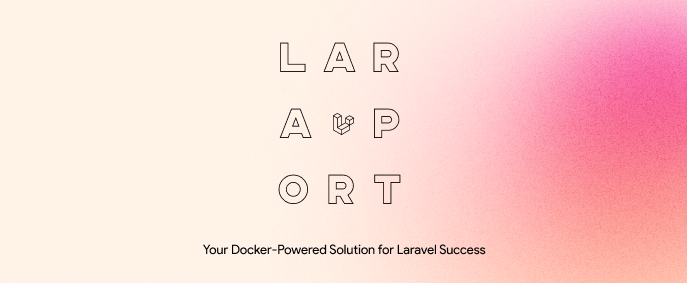

## About Laraport
Laraport sets up a Dockerized development environment for Laravel applications. It includes configurations for PHP 8.3, MySQL 8.3, Nginx.


### Why Laraport? 
My first ever touch with Laravel was lack of containerization. Laravel offers their own way for Dockerized Development using [Laravel Sail](https://laravel.com/docs/10.x/sail) but 
the user still needs to have composer, php, nginx installed on his local machine. But with Laraport you only need to have [Docker](https://www.docker.com/)

### Architecture Overview

- **Laravel**
- **PHP 8.3**
- **MySQL 8.3** `3306`
- **Nginx** `8000:80`
- **Adminer** `8080`


### How to Install

To set up the environment, follow these steps:

1. Install Docker
2. Clone this repository to your local machine.
3. Navigate to the project directory `cd project-directory`
4. Run `make laraport` to initiate the setup process.
5. Navigate to http://localhost:8000/ 
6. Setup is done! Happy Coding :rocket:
```
# Using Makefile
make setup 

# Using Docker-Compose
# Use Laravel Documentation to initialize your project
docker-compose up -d
```

### After Installation

Once the installation is complete, you can perform the following actions:

- **Connect to the container**: Use `docker exec -it laraport sh` to access the Laravel application container.
- **Stop the container**: Execute `docker-compose stop` to halt the running containers.
- **Start the container**: Run `docker-compose start` to start the containers.

### Adminer
Adminer is a lightweight, yet powerful database management tool written in PHP

To access Adminer, navigate to `http://localhost:8080` in your web browser. Once accessed, you can log in using the database credentials provided in your `.env` file


### Disclaimer

Laraport is a project developed by Daniel Peci, hosted on GitHub, aimed at providing a Docker environment tailored for Laravel development. Laraport utilizes the Laravel logo and includes "Lara" in its name for descriptive purposes only.

It is important to note that Laraport is an independent project and is not affiliated with, endorsed by, or sponsored by Laravel or its associated projects. The usage of the Laravel logo and the inclusion of "Lara" in the name are not intended for commercial purposes.

Laraport is made available solely for non-commercial use, and its primary distribution channel is GitHub. Users should understand that Laraport is a community-driven initiative and should not be mistaken for an official Laravel product or service.

By using Laraport, users acknowledge that it is an independent project and that Daniel Peci assumes no responsibility for any issues or liabilities arising from its usage.

For further inquiries or clarifications, please direct message me.

